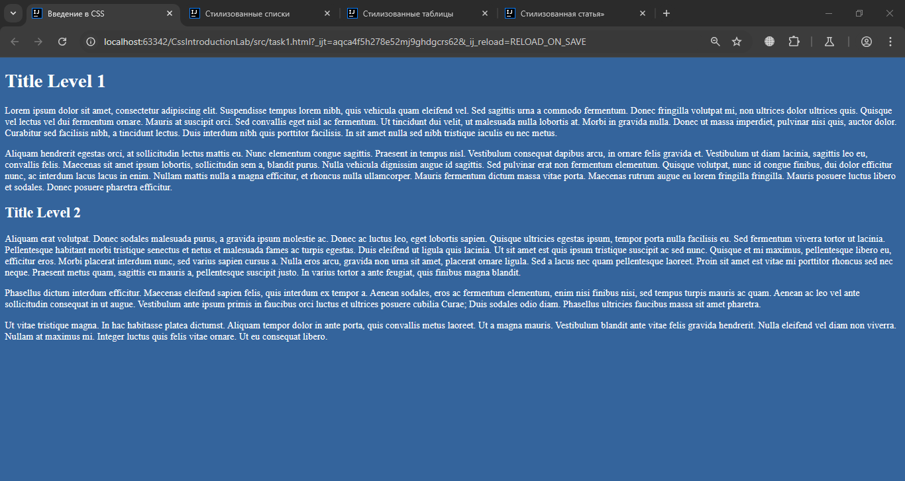
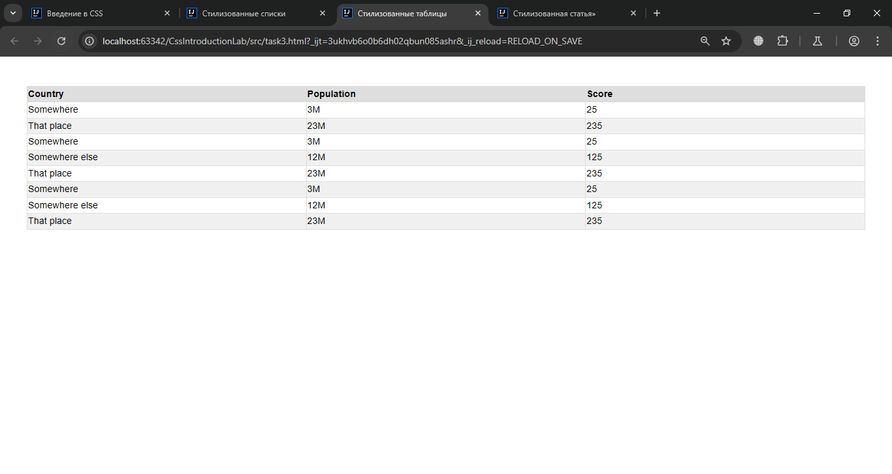

# Лабораторная абота №2. Введение в CSS
Дисциплина: Разработка веб-приложений
## Задание 1
Создайте веб-страницу. Требования:
- Измените заголовок документа на «Введение в CSS»
- Используйте теги h1 и h2 для заголовков
- Используйте фон с цветом - rgb(52, 100, 156)
### Демонстрация работы

## Задание 2
Создайте веб-страницу. Требования:
- Измените заголовок документа на «Стилизованные списки»
- Используйте семейство шрифтов: Helvetica, sans-serif, с размером шрифта: 16px и высотой строки: 1.5
- Добавьте секцию с двумя статьями внутри (для каждого списка); Каждая статья должна иметь заголовок h2; Используйте ul для неупорядоченного списка; Добавьте не менее 4 элемента списка; Используйте ol reversed для упорядоченного реверсированного списка; Добавьте не менее 3 элемента списка
### Демонстрация работы

## Задание 3
Создайте веб-страницу. Требования:
- Измените заголовок документа на «Стилизованные таблицы»
- Стиль нечетных tr с фоном: rgb(240, 240, 240)
- Стиль td в каждой нечетной строке с фоном: rgb(240, 240, 240)
- Теги table, td и th (Ширина границы - 1px; Цвет границы - rgb(222, 222, 222); Стиль границы - сплошной) 
- При наведении указателя мыши на строку таблицы необходимо обновить следующие стили (Фон: rgb(0, 0, 0); Цвет текста: rgb(255, 255, 255))
### Демонстрация работы
До наведения курсора на строку:

После наведения курсора на строку:

## Задание 4
Создайте веб-страницу. Требования:
- Название документа должно быть «Стилизованная статья»
- Создайте статью используя тег article внутри body (Фон с цветом rgb(52, 100, 156); Радиус границы - 1rem; Используйте шрифты Helvetica, sans-serif font-family; 
Размер шрифта 16px; Высота строки - 1,5; Используйте для заголовков семейство шрифтов Georgia, serif)
### Демонстрация работы
